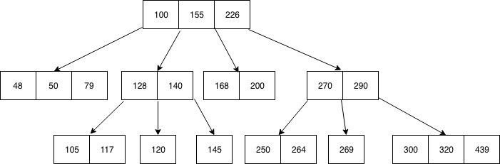
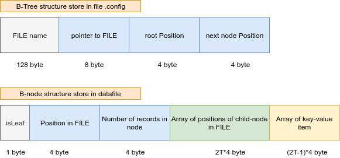

# Implement key-value store

  - [Nhắc lại B-Tree](#nh%e1%ba%afc-l%e1%ba%a1i-b-tree)
  - [Hiện thực B-Tree](#hi%e1%bb%87n-th%e1%bb%b1c-b-tree)
  - [Hiện thực service](#hi%e1%bb%87n-th%e1%bb%b1c-service)
    - [Bài toán readers/writers](#b%c3%a0i-to%c3%a1n-readerswriters)
  - [How to use Service](#how-to-use-service)

## Nhắc lại B-Tree

<div align="center">
	
	<br/>
	<span align="center"><i></i></span>
	<br/>

</div>

- Node x có **n[x]** key thì sẽ có **n[x]+1** con.
- Mọi node lá đều có cùng độ sâu.
- Khi sử dụng B-tree, ta định trước một số nguyên **t**. Mỗi node trong của B-tree (trừ root) có từ **t-1** tới **2t-1** key. Hệ số 2 đảm bảo rằng các node có thể được chia đôi hoặc kết hợp.
- *Thao tác chèn:* khi 1 node đã đầy (có 2t-1 key), ta có thể lấy key giữa trong 2t-1 key chèn vào node cha và chia 2t-2 key còn lại vào hai node mới, mỗi node t-1 key. Tương tự như vậy, khi một node và node kế bên đều có t-1 key, ta có thể kết hợp hai node cùng với một key từ node cha thành một node mới có 2t-1 key.

- Tại sao lại là **B-Tree**

  - Vì tính chất tự cân bằng của nó giúp đảm bảo quá trình search, insert (get/set) là nhanh nhất.
  - Truy cập vào disk rất chậm và mỗi lần đọc phải load cả sector lên mem. Cho nên thay vì chỉ lưu 1 số trên 1 node (xác định node kế nên visit là left hay right) ta có thể tạo ra một vùng chỉ mục lớn hơn (xác định node kế nên visit vị trí đầu, vị trí 2, ... hay vị trí 100). Hơn nữa đọc 1 lần tất cả node đủ trên 1 sector sẽ bớt phí hơn.

## Hiện thực B-Tree

> Tham khảo pseudocode: [Introduction to Algorithms](http://staff.ustc.edu.cn/~csli/graduate/algorithms/book6/chap19.htm), code: [GeeksforGeeks](https://www.geeksforgeeks.org/b-tree-set-3delete/)

- Cấu trúc của BTree được tổ chức như sau:

    ```c++
    struct BTree
    {
        char fname[128];// path of the data-file to store the B-Tree
        FILE *pFile;   // pointer to the data-file
        int root;      // position of the root
        int nextPos;   // next position for new node
    };

    struct BNode
    {
        bool isLeaf;         // true if node is Leaf
        int pos;             // position of this node in FILE
        int count;           // current number of records at each node
        int children[2 * t]; // array of positions of child-node in FILE
        Item keys[2 * t - 1];// array of records at each node
    };

    struct Item
    {
        char key[300];
        char val[512];
    };
    ```
    Cụ thể như sau:

    

- Xác định t = 3 (tối thiểu 3 record trên 1 node) cùng với kích thước key = 300, value = 512 ta được kích thước 1 node là `4096 byte` (`1+3(padding)+4*2+4*(t=3)+812*5`), bằng với kích thước 1 page mà mỗi lần read/write truy xuất.
- Để có thể lưu lại cấu trúc 1 B-Tree cho lần sử dụng sau này, ta lưu lại node root trong file `.config`

    ```c++
    void BTreeClose(BTree* tree) {
        FILE *f = fopen(".config","w");
        fseek(f, 0, SEEK_SET);
        fwrite(tree, sizeof(BTree), 1, f);
        fclose(f);

        fclose(tree->pFile); //close the file which used to store B-Tree
        free(tree);
    }
    ```
- Khi khởi động, chương trình sẽ mở file `.config`, load node root vào B-Tree được tạo ra trên mem, sau đó tiếp tục các thao tác trên file `datafile.dat`

    ```c++
    BTree *tree = (BTree*)malloc(sizeof(BTree));
    FILE *config = fopen(".config", "r");
    fread(tree, sizeof(BTree), 1, config);
    fclose(config);

    tree->pFile = fopen(fname, "r+");
    return tree;
    ```
- Tác vụ DISK-READ và DISK-WRITE

    ```c++
    void diskWrite(BTree* ptrBTree, BNode* p, int pos) {
        if(pos == -1) {
            pos = ptrBTree->nextPos++;
        }
        fseek(ptrBTree->pFile, pos * sizeof(BNode), 0);
        fwrite(p, sizeof(BNode), 1, ptrBTree->pFile);
    }

    void diskRead(BTree* ptrBTree, BNode* p, int pos) {
        fseek(ptrBTree->pFile, pos * sizeof(BNode), 0);
        fread(p, sizeof(BNode), 1, ptrBTree->pFile);
    }
    ```

## Hiện thực service

> Tham khảo [jameshfisher.com](https://jameshfisher.com/2017/04/05/set_socket_nonblocking/), [mkssoftware.com](https://www.mkssoftware.com/docs/man3/select.3.asp), [How to use select() on sockets properly?](https://stackoverflow.com/questions/32711521/how-to-use-select-on-sockets-properly), [progschj/ThreadPool](https://github.com/progschj/ThreadPool), [Nonblocking I/O and select()](https://www.ibm.com/support/knowledgecenter/en/ssw_ibm_i_72/rzab6/xnonblock.htm)

- Mô hình sử dụng ThreadPool và nonblocking server:

<div align="center">
	
	<br/>
	<span align="center"><i></i></span>
	<br/>

</div>

- Chi tiết server dùng nonblocking và select() API.

<div align="center">
	
	<br/>
	<span align="center"><i></i></span>
	<br/>

</div>

- Hiện thực ThreadPool (thư viện sử dụng [progschj/ThreadPool](https://github.com/progschj/ThreadPool))

    ```c++
    class ThreadPool {
    public:
        ThreadPool(size_t);
        template<class F, class... Args>
        auto enqueue(F&& f, Args&&... args)-> std::future<typename std::result_of<F(Args...)>::type>;
        ~ThreadPool();
    private:
        /* keep track of threads so we can join them */
        std::vector< std::thread > workers;
        std::queue< std::function<void()> > tasks;

        /* synchronization */
        std::mutex queue_mutex;
        std::condition_variable condition;
        bool stop;
    };
    ```

### Bài toán readers/writers

- *Reader process*:

    ```c++
    wait (mutex);
    rc ++;
    if (rc == 1)
    wait (wrt);
    signal(mutex);
        /**
         * READ THE OBJECT
        */
    wait(mutex);
    rc --;
    if (rc == 0)
        signal (wrt);
    signal(mutex);

    ```

  - Trong đó `mutex` và `wrt` là 2 biến semaphore được khởi tạo bằng 1. `rc` là biến đếm được khởi tạo bằng 0. Mutex semaphore đảm bảo tính loại trừ tương hỗ và `wrt` chịu trách nhiệm cho cơ chế writing, đưa cho reader và writer xử lý code.
  - `rc` đại diện cho số lượng readers đang truy cập vào object, ngay khi `rc=1`, tác vụ wait thực hiện trên `wrt`. Điều này nghĩa là writer sẽ không thể truy cập vào object nữa. Khi `rc=0`, tác vụ signal thực hiện trên `wrt`, nhờ đó writer có thể truy cập vào object.

- *Writer process*:

    ```c++
    wait(wrt);
    /**
     * WRITE INTO THE OBJECT
     */
    signal(wrt);
    ```
  
  - Nếu writer muốn truy cập vào object, tác vụ wait sẽ thực hiện trên `wrt`, sau đó không có writer nào có thể truy cập vào object nữa, khi writer đã thực hiện xong writing vào object thì signal thực thi trên `wrt`.

## How to use Service

- [How to use](./install.md)
- Simple example make: [link](https://github.com/anhldbk/simple-make/blob/master/README.md)

    ```sh
    .
    ├── Client
    │   ├── Client
    │   ├── Client.cpp
    │   ├── Client.o
    │   ├── makefile
    │   └── Utils.h
    ├── README.md
    └── Server
        ├── app
        │   └── src
        │       ├── makefile
        │       ├── Server.cpp
        │       └── Server.o
        ├── build
        │   ├── app
        │   └── libmeta.a
        ├── datafile.dat
        ├── libs
        │   └── meta
        │       ├── include
        │       │   ├── BNode.h
        │       │   ├── BTree.h
        │       │   ├── Connection.h
        │       │   ├── ThreadPool.h
        │       │   └── Utils.h
        │       └── src
        │           ├── BTree.cpp
        │           ├── BTree.o
        │           └── makefile
        └── makefile
    ```
